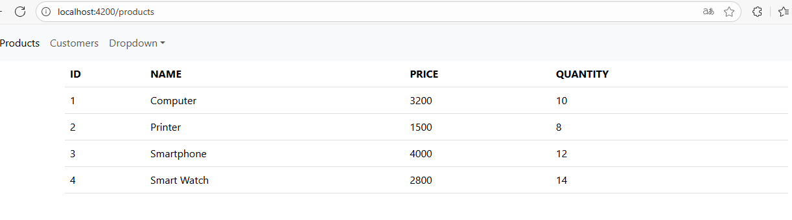
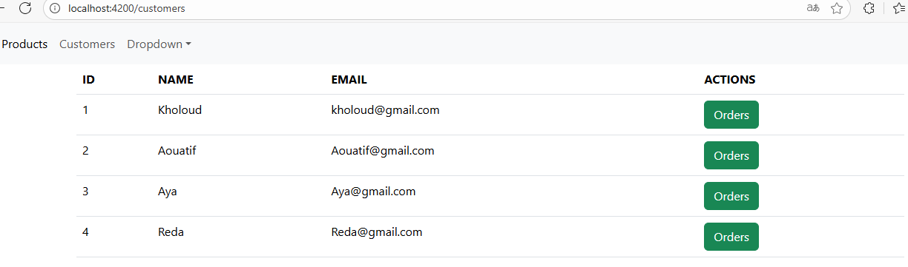
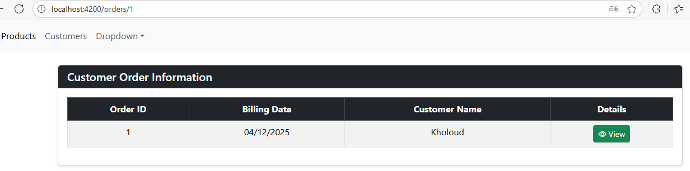
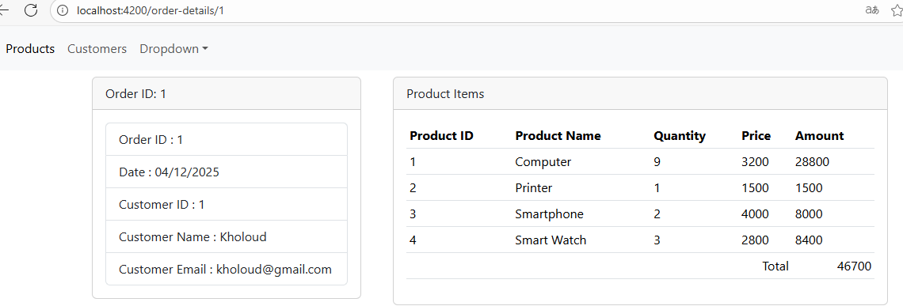

# EcomWebApp

Application e-commerce développée avec Angular pour la gestion des produits, clients et commandes.


## 📋 Table des matières

- [À propos](#à-propos)
- [Fonctionnalités](#fonctionnalités)
- [Captures d'écran](#captures-décran)
- [Installation](#installation)
- [Utilisation](#utilisation)
- [Technologies utilisées](#technologies-utilisées)

## 🎯 À propos

EcomWebApp est une application web de gestion e-commerce construite avec Angular 16. Elle permet de gérer un catalogue de produits, une liste de clients et leurs commandes avec un système de navigation fluide entre les différentes pages.

## ✨ Fonctionnalités

- **Gestion des produits** : Affichage d'un catalogue de produits avec ID, nom, prix et quantité
- **Gestion des clients** : Liste des clients avec leurs informations de contact
- **Gestion des commandes** : Système de commandes lié aux clients
- **Détails des commandes** : Vue détaillée de chaque commande avec les produits commandés
- **Navigation intuitive** : Navigation entre les pages Products, Customers et Orders
- **Interface responsive** : Design adaptatif pour tous les écrans

## 📸 Captures d'écran

### Page Produits


La page produits affiche un tableau avec tous les produits disponibles :
- ID du produit
- Nom du produit
- Prix unitaire
- Quantité en stock

**Route** : `/products`

---

### Page Clients


La page clients liste tous les clients enregistrés avec :
- ID du client
- Nom complet
- Adresse email
- Bouton "Orders" pour accéder aux commandes du client

**Route** : `/customers`

---

### Page Commandes


Cette page affiche les informations de commande pour un client spécifique :
- Order ID
- Date de facturation
- Nom du client
- Bouton "View" pour voir les détails de la commande

**Route** : `/orders/:customerId`

---

### Détails de la commande


Page de détails complète d'une commande comprenant :

**Section gauche** :
- Order ID
- Date de commande
- Customer ID
- Nom du client
- Email du client

**Section droite - Product Items** :
- Tableau des produits commandés
- Quantité par produit
- Prix unitaire
- Montant total par produit
- Total général de la commande

**Route** : `/order-details/:orderId`

## 🚀 Installation

### Prérequis

- Node.js (version 14 ou supérieure)
- npm (Node Package Manager)
- Angular CLI 16.1.0

### Étapes d'installation

1. Cloner le repository :
```bash
git clone <repository-url>
cd EcomWebApp
```

2. Installer les dépendances :
```bash
npm install
```

3. Installer Angular CLI globalement (si ce n'est pas déjà fait) :
```bash
npm install -g @angular/cli@16.1.0
```

## 💻 Utilisation

### Démarrer le serveur de développement

```bash
ng serve
```

Naviguez vers `http://localhost:4200/`. L'application se rechargera automatiquement si vous modifiez les fichiers sources.

### Navigation dans l'application

1. **Page d'accueil** : Accédez à `/products` pour voir le catalogue
2. **Clients** : Cliquez sur "Customers" dans la navigation
3. **Commandes d'un client** : Cliquez sur le bouton "Orders" à côté d'un client
4. **Détails d'une commande** : Cliquez sur "View" pour voir les détails complets

## 🛠️ Technologies utilisées

- **Angular 16.1.0** : Framework principal
- **TypeScript** : Langage de programmation
- **Angular Router** : Gestion de la navigation
- **HTML5 & CSS3** : Structure et style
- **Bootstrap** (optionnel) : Framework CSS

Pour plus d'aide sur Angular CLI, consultez la page [Angular CLI Overview and Command Reference](https://angular.io/cli).

## 🔄 Flux de navigation

```
Products Page
    ↓
Customers Page → Click "Orders" button
    ↓
Orders Page → Click "View" button
    ↓
Order Details Page
```
